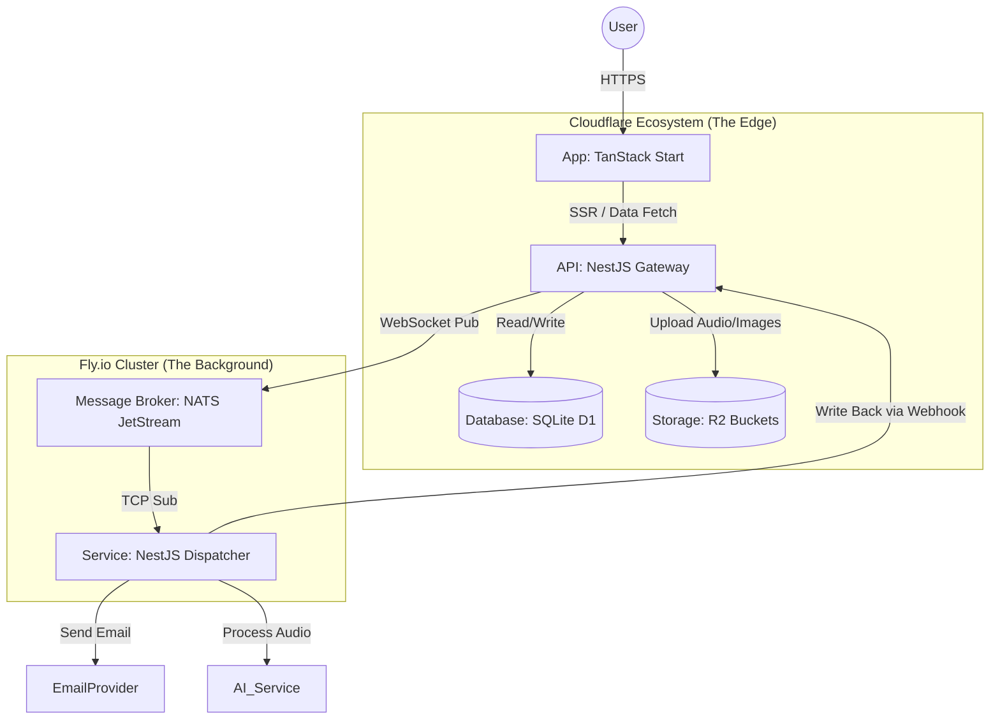
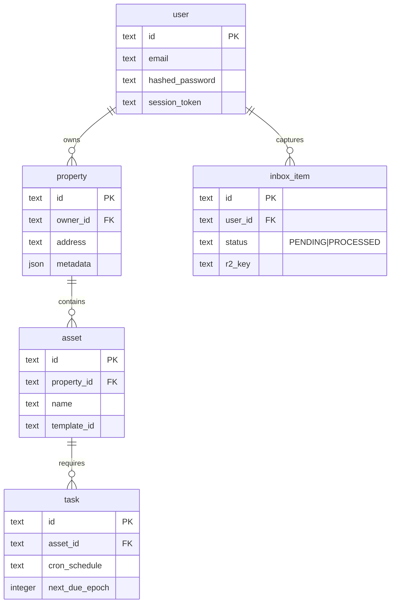

# Architecture Reference: Haven

> **Philosophy:** "Edge for Speed, Server for Heavy Lifting."
>
> We utilize Cloudflare's global network for the user-facing application (Frontend, API, DB) to ensure <50ms latency. We utilize a persistent Fly.io cluster for event sourcing and background processing that requires long-running processes (NATS, Audio Processing).

---

## 1. High-Level Topology



---

## 2. Technical Stack

**Frontend (The View Layer)**

- **Framework:** TanStack Start (React 19).
- **Deployment:** Cloudflare Workers (SSR).
- **State Management:** TanStack Query (via RPC/API).
- **Styling:** TailwindCSS + Shadcn/ui.

**Edge API (The Brain)**

- **Framework:** NestJS.
- **Runtime:** Cloudflare Workers (via @nestjs/platform-fastify or custom adapter).
- **Database:** Cloudflare D1 (SQLite).
- **ORM:** Drizzle ORM (Lightweight, typed, D1 compatible).
- **Auth:** Better Auth (handling Sessions/Cookies via D1 adapter).
- **Storage:** Cloudflare R2 (for "Quick Capture" assets).

**Background Infrastructure (The Muscle)**

- **Message Broker:** NATS JetStream (Official Docker Image).
- **Dispatcher Service:** NestJS Microservice (Standard TCP Transport).
- **Deployment:** Fly.io (Docker).

---

## 3. Monorepo Structure (pnpm workspaces)

```plaintext
/haven-monorepo
├── /apps
│   ├── /web                 # TanStack Start (SSR React) -> CF Worker
│   ├── /api                 # NestJS Edge Gateway -> CF Worker
│   ├── /dispatcher          # NestJS Microservice -> Fly.io
│   └── /nats-broker         # NATS Config & Dockerfile -> Fly.io
│
├── /packages
│   ├── /db                  # Shared Drizzle Schema & D1 Migrations
│   ├── /events              # Shared NATS Subjects & DTOs
│   └── /tsconfig            # Shared TS Configs
│
├── package.json
├── pnpm-workspace.yaml
└── wrangler.toml            # Cloudflare Infrastructure Config
```

---

## 4. Data Flow Patterns

**A. Synchronous Read (Dashboard Load)**

- **Goal:** Load the "House Health" status instantly.
- **Flow:**
  1. User requests `/dashboard`.
  2. `apps/web` (TanStack Start) creates a server-side request.
  3. `apps/web` calls `apps/api` (NestJS).
  4. `apps/api` queries `D1` (SQLite) via Drizzle.
  5. Data returned -> SSR Render -> Hydrate on Client.

**B. Asynchronous Action (Quick Capture)**

- **Goal:** User records audio of a weird noise; we process it later.
- **Flow:**
  1. User uploads audio blob to `apps/api`.
  2. `apps/api` saves blob to **R2 Storage**.
  3. `apps/api` creates `InboxItem` in **D1** (Status: `PROCESSING`).
  4. `apps/api` publishes event `asset.capture.created` to **NATS** (via WebSocket).
  5. `apps/dispatcher` (on Fly.io) receives event.
  6. `apps/dispatcher` downloads audio, runs AI transcription/analysis.
  7. `apps/dispatcher` calls `apps/api` webhook to update `InboxItem` status.

---

## 5. Database Schema (D1 / SQLite)

We use **Drizzle ORM** for type safety and migrations.



---

## 6. Infrastructure & Deployment Strategy

**Cloudflare (wrangler.toml)**

- **Production:** `api.haven.app` (NestJS), `haven.app` (TanStack Start).
- **Binding:** The API Worker is bound to the `DB` (D1) and `BUCKET` (R2).
- **Secrets:** `BETTER_AUTH_SECRET`, `NATS_WS_URL`.

**Fly.io (fly.toml)**

- **Service 1:** `haven-nats` (Port 4222 TCP, Port 8080 WS).
- **Service 2:** `haven-dispatcher` (Connects to `haven-nats` via internal private network).
- **Volume:** `haven-nats` mounts a persistent volume for JetStream (event durability).

---

## 7. Key Implementation Details

1. **NestJS on Workers:**

- We cannot use the default `express` adapter. We must use a fetch-compatible adapter or the `NestFactory.createApplicationContext` pattern if we want pure functions.
- _Decision:_ We will use standard NestJS with the `@nestjs/platform-fastify` adapter, wrapped in a lightweight Cloudflare Worker entry point.

2. **NATS via WebSocket:**

- Cloudflare Workers cannot make raw TCP connections easily.
- The **NestJS API** will use the `nats.ws` library (WebSocket) to publish events to the Fly.io NATS server.
- The **Fly.io Dispatcher** will use the standard TCP `nats` library.

3. **Better Auth + D1:**

- We will use the **Better Auth Drizzle Adapter**.
- Session tokens are stored in D1.
- The frontend (TanStack Start) passes cookies; the API validates them against D1.
