# Architecture Reference: Haven

> **Philosophy:** "One Platform, Zero Overhead."
>
> Everything runs on Fly.io — the frontend, API, database, event bus, and background workers. One platform to deploy, monitor, and scale. No multi-cloud juggling.

---

## 1. Request Lifecycle (User → Frontend → API)


---

## 2. System Architecture


---

## 3. Service Responsibilities

| Service               | What It Does                                                                                                                          | What It Does NOT Do                            |
| --------------------- | ------------------------------------------------------------------------------------------------------------------------------------- | ---------------------------------------------- |
| **`apps/web`**        | SSR rendering, client-side routing, passes auth cookies to API                                                                        | Business logic, direct DB access, file storage |
| **`apps/api`**        | All CRUD operations, auth (login/signup/sessions), file uploads to Tigris, publishes events to NATS                                   | AI processing, sending emails, cron jobs       |
| **`apps/dispatcher`** | Subscribes to NATS events, processes captures (AI transcription/image analysis), sends emails/notifications, runs scheduled cron jobs | Serving HTTP requests, handling user auth      |

**`apps/web` — The View Layer**

- Renders the UI via SSR. Fetches data from the API. Manages client-side state with TanStack Query.
- Has zero direct access to the database or storage — everything goes through the API.

**`apps/api` — The Gateway**

- The single HTTP entry point for all client requests. Owns all CRUD operations (properties, assets, tasks, supplies, logs, inbox items).
- Handles authentication (Better Auth) and authorization.
- Uploads files to Tigris and returns storage keys.
- Publishes domain events to NATS (e.g., `asset.capture.created`, `task.completed`) but does NOT process them.

**`apps/dispatcher` — The Worker**

- A headless NestJS microservice (no HTTP server). Connects to NATS and listens for events.
- Handles all heavy/slow work: AI processing (audio transcription, image analysis), email delivery, push notifications.
- Runs scheduled jobs via `@nestjs/schedule` (e.g., scanning for overdue tasks every hour).
- Writes results back to PostgreSQL directly (shared DB access with the API).

---

## 4. Technical Stack

**Frontend**

- **Framework:** TanStack Start (React 19).
- **Deployment:** Fly.io (Node.js SSR).
- **State Management:** TanStack Query (via API calls).
- **Styling:** TailwindCSS + Shadcn/ui.

**API**

- **Framework:** NestJS.
- **Adapter:** `@nestjs/platform-fastify`.
- **Runtime:** Node.js on Fly.io.
- **Database:** PostgreSQL (Fly Postgres).
- **ORM:** TypeORM.
- **Auth:** Better Auth (Sessions/Cookies via PostgreSQL adapter).
- **Storage:** Tigris (Fly.io's S3-compatible object storage, via `@aws-sdk/client-s3`).

**Background Infrastructure**

- **Message Broker:** NATS JetStream (Docker).
- **Dispatcher Service:** NestJS Microservice (NATS transport).
- **Scheduled Tasks:** `@nestjs/schedule` (cron-based).
- **Deployment:** Fly.io (Docker).

---

## 5. Monorepo Structure (pnpm workspaces)

```plaintext
/haven-monorepo
├── /apps
│   ├── /web                 # TanStack Start (SSR React) -> Fly.io
│   ├── /api                 # NestJS API Gateway -> Fly.io
│   └── /dispatcher          # NestJS Microservice -> Fly.io
│
├── /packages
│   ├── /db                  # Shared TypeORM Entities & Migrations
│   ├── /events              # Shared NATS Subjects & DTOs
│   └── /tsconfig            # Shared TS Configs
│
├── /infra
│   ├── docker-compose.yml   # Local dev: Postgres + NATS
│   └── fly.toml             # Fly.io deployment config
│
├── package.json
└── pnpm-workspace.yaml
```

---

## 6. Data Flow Patterns

**A. Synchronous Read (Dashboard Load)**

- **Goal:** Load the "House Health" status.
- **Flow:**
  1. User requests `/dashboard`.
  2. `apps/web` (TanStack Start) creates a server-side request.
  3. `apps/web` fetches from `apps/api` (NestJS) over the Fly.io internal network.
  4. `apps/api` queries PostgreSQL via TypeORM.
  5. Data returned -> SSR Render -> Hydrate on Client.

**B. Asynchronous Action (Quick Capture)**

- **Goal:** User captures an issue (photo, voice memo, or text note); we process it later.
- **Flow:**
  1. User submits a capture (photo, audio, or text) to `apps/api`.
  2. `apps/api` saves blob to **Tigris** (via S3-compatible API).
  3. `apps/api` creates `InboxItem` in **PostgreSQL** (Status: `PROCESSING`).
  4. `apps/api` publishes event `asset.capture.created` to **NATS** (via TCP).
  5. `apps/dispatcher` receives event via NATS subscription.
  6. `apps/dispatcher` downloads the file from Tigris, runs AI processing (transcription for audio, analysis for images).
  7. `apps/dispatcher` updates `InboxItem` status directly in PostgreSQL.

**C. Scheduled Maintenance (Cron)**

- **Goal:** Notify users when maintenance tasks are due.
- **Flow:**
  1. `apps/dispatcher` runs a `@Cron()` job (e.g., every hour).
  2. Queries PostgreSQL for tasks where `next_due_at <= now()`.
  3. Publishes `task.due` events to NATS for each due task.
  4. Notification handler sends push/email to the user.
  5. When user marks task done, `apps/api` logs it and resets `next_due_at`.

---

## 7. Database Schema (PostgreSQL)

We use **TypeORM** for type safety, entities, and migrations.

```mermaid
erDiagram
    user {
        uuid id PK
        text email
        text hashed_password
        timestamp created_at
    }

    property {
        uuid id PK
        uuid owner_id FK
        text name
        text address
        jsonb metadata
    }

    zone {
        uuid id PK
        uuid property_id FK
        text name "e.g. Basement, Kitchen"
    }

    asset {
        uuid id PK
        uuid zone_id FK
        text name
        text template_id
        jsonb metadata "model, serial, etc."
    }

    task {
        uuid id PK
        uuid asset_id FK
        text name
        text cron_schedule
        timestamp next_due_at
    }

    supply {
        uuid id PK
        uuid asset_id FK
        text name "e.g. Filter 20x25x4"
        text part_number
        text purchase_url
    }

    log {
        uuid id PK
        uuid asset_id FK
        uuid user_id FK
        text action "e.g. Replaced Filter"
        text notes
        timestamp performed_at
    }

    document {
        uuid id PK
        uuid asset_id FK
        text name "e.g. Owner Manual"
        text storage_key
        text mime_type
    }

    inbox_item {
        uuid id PK
        uuid user_id FK
        text status "PENDING|PROCESSING|PROCESSED"
        text storage_key
        text transcription
        timestamp created_at
    }

    user ||--o{ property : owns
    property ||--o{ zone : contains
    zone ||--o{ asset : contains
    asset ||--o{ task : requires
    asset ||--o{ supply : consumes
    asset ||--o{ log : history
    asset ||--o{ document : manuals
    user ||--o{ inbox_item : captures
    user ||--o{ log : performed_by
```



---

## 8. Infrastructure & Deployment Strategy

**Fly.io (`fly.toml`)**

- **`haven-web`:** TanStack Start (Node.js SSR, Port 3001). Fetches from API over internal network.
- **`haven-api`:** NestJS API (Port 3000). Connects to Postgres, Tigris, and NATS via Fly internal network.
- **`haven-dispatcher`:** NestJS Microservice. Connects to NATS and Postgres via Fly internal network.
- **`haven-nats`:** NATS JetStream (Port 4222 TCP). Persistent volume mounted for event durability.
- **`haven-db`:** Fly Postgres. Managed by `fly postgres create`.
- **`haven-storage`:** Tigris bucket. Created via `fly storage create`.
- **Networking:** All services communicate over Fly.io's private `.internal` network (e.g., `haven-api.internal:3000`).

**Environment Variables (API)**

- `DATABASE_URL` — Postgres connection string (Fly internal).
- `NATS_URL` — `nats://haven-nats.internal:4222`.
- `AWS_ENDPOINT_URL_S3`, `AWS_ACCESS_KEY_ID`, `AWS_SECRET_ACCESS_KEY` — Tigris S3 credentials (auto-injected by Fly.io).
- `BUCKET_NAME` — Tigris bucket name.
- `BETTER_AUTH_SECRET` — Auth signing secret.

---

## 9. Key Implementation Details

1. **Internal Service Communication:**

- TanStack Start and NestJS API are co-located on Fly.io. The frontend makes `fetch()` calls to the API over the internal `.internal` network (e.g., `http://haven-api.internal:3000`), avoiding public internet round-trips.
- Auth cookies are forwarded with each request. The API validates sessions against PostgreSQL.

2. **Tigris Object Storage:**

- Tigris is Fly.io's native S3-compatible storage. Access it using `@aws-sdk/client-s3` — credentials are auto-injected by Fly.io.
- Presigned upload URLs can be generated by the API for direct client-to-Tigris uploads.

3. **Better Auth + PostgreSQL:**

- We use the **Better Auth TypeORM Adapter**.
- Session tokens are stored in PostgreSQL.
- The frontend (TanStack Start) passes cookies; the API validates them against PostgreSQL.

4. **NATS Connection:**

- Both `apps/api` and `apps/dispatcher` connect to NATS via standard TCP on the Fly.io internal network.
- All services co-located — no special networking required.

---

## 10. Local Development

```plaintext
# Start infrastructure
docker compose up -d    # Postgres + NATS + MinIO (S3-compatible)

# Start services
pnpm --filter api dev         # NestJS API on :3000
pnpm --filter dispatcher dev  # NestJS Dispatcher
pnpm --filter web dev         # TanStack Start on :3001 (proxies to :3000)
```

**`docker-compose.yml`** provides:

- PostgreSQL on `localhost:5432`
- NATS JetStream on `localhost:4222`
- MinIO on `localhost:9000` (local S3 replacement for Tigris)

The TanStack Start dev server proxies API requests to `localhost:3000`.
