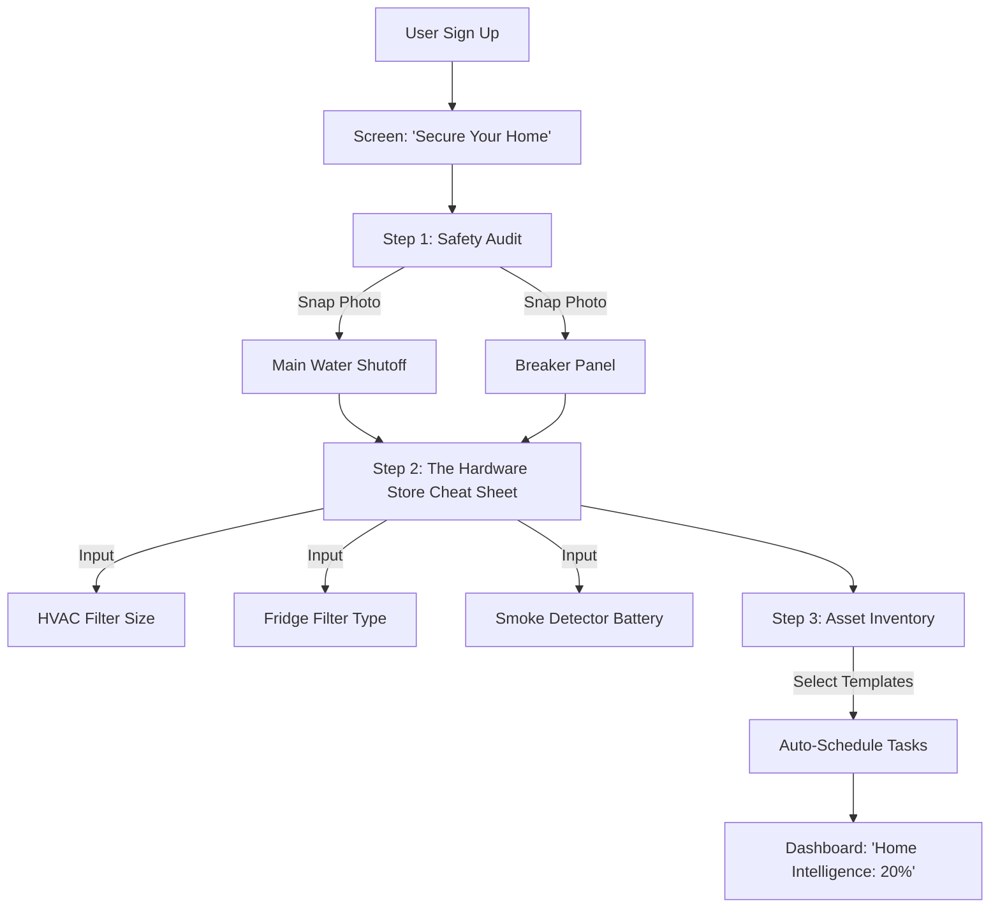
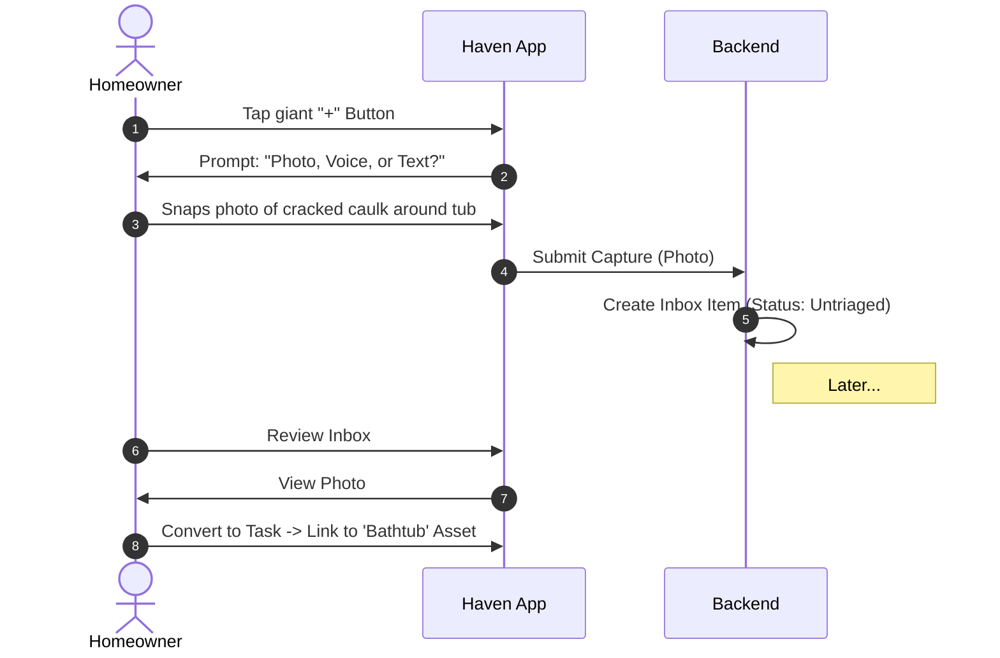
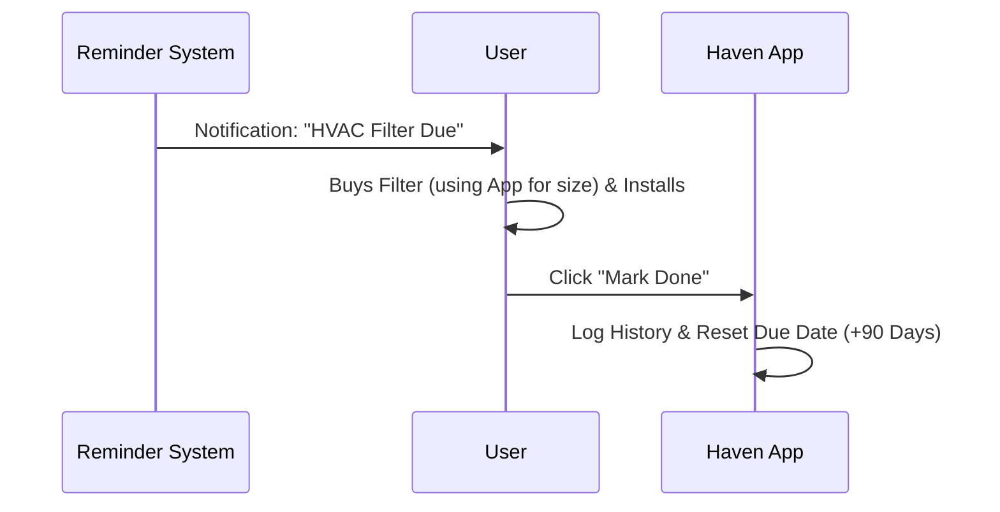
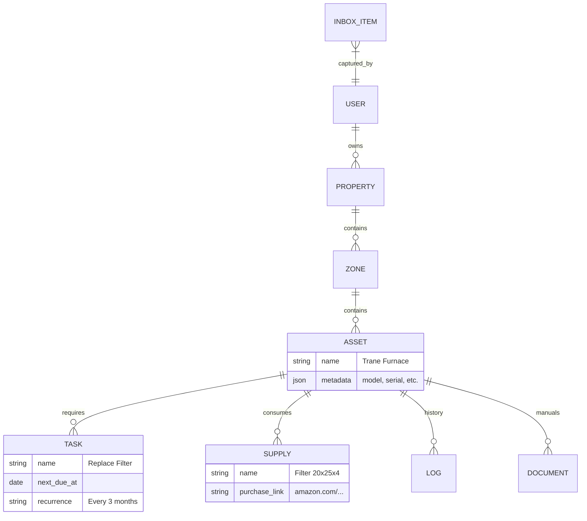

# Product Requirement Document: Haven

"The Second Brain for Your Home"

---

## 1. The Vision

Homeownership relies on "Tribal Knowledge" (stuff only you know) and fragile memory. This causes stress, nagging, and forgotten maintenance.

Haven is an **Async Home Operating System**. It is the single source of truth for the physical state of your house. It allows you to:

1. **Offload Memory:** "I don't need to remember the filter size; Haven knows."
2. **Eliminate Friction:** "I don't need to ask if the salt is full; I check the log."
3. **Disaster Proof:** "If I'm not home, my family can find the water shutoff in 10 seconds."

---

## 2. The Scope (SLC: Simple, Lovable, Complete)

- **Simple:** We track Assets, Tasks, and Supplies. No complex depreciation math.
- **Lovable:** The Onboarding pays for itself immediately ("The Hardware Store Audit"). The UI is instant.
- **Complete:** The full loop exists: Capture -> Schedule -> Notify -> Resolve.

---

## 3. User Flows

### A. The Onboarding Flow ("The Hardware Store Audit")

We replace "Data Entry" with a "Safety & Supply Audit."



### B. The "Quick Capture" Loop (Inbox Zero for Home)

You see an issue. You don't have time to fix it. You capture it.



### C. The Maintenance Loop (Automated)

The system reminds you to do the work.



---

## 4. Data Model (Conceptual)

The data model is designed for multi-tenancy (You + Parents) and deep asset history.



---

## 5. UI Wireframes

**Screen 1: The Onboarding (Step 2)**

**Goal:** Solve the "Hardware Store Amnesia" problem.

```plaintext
+-------------------------------------------------------+
|  < Back          Step 2 of 3                          |
+-------------------------------------------------------+
|  THE "HARDWARE STORE" CHEAT SHEET                     |
|                                                       |
|  Stop guessing at the store. Log your sizes now.      |
|                                                       |
|  HVAC Filter Size                                     |
|  [ 16 x 25 x 1       v ] (Select or Type)             |
|                                                       |
|  Refrigerator Water Filter                            |
|  [ Samsung HAF-QIN   v ] (Auto-suggest based on brand)|
|                                                       |
|  Smoke Detector Battery Type                          |
|  [ 9V / AA / Hardwired ]                              |
|                                                       |
|  [  Next: The Big Hardware  ]                         |
+-------------------------------------------------------+
```

**Screen 2: The Dashboard (Homeowner View)**

**Goal:** High-level status and quick capture.

```plaintext
+-------------------------------------------------------+
|  [ Menu ]          HAVEN: Mundelein        [ Profile ]|
+-------------------------------------------------------+
|  MY WEEKEND LIST                                      |
|  [ ] Flush Water Heater (Est: 45m)                    |
|  [ ] Change Furnace Filter (Est: 5m)                  |
|  [See All Tasks >]                                    |
+-------------------------------------------------------+
|                                                       |
|           [  BIG CAPTURE BUTTON (+)  ]                |
|           "Log an issue or idea..."                   |
|                                                       |
+-------------------------------------------------------+
|  HOUSE HEALTH                                         |
|  🟢 HVAC System     🟢 Plumbing     🟡 Garage Door     |
+-------------------------------------------------------+
|  RECENT LOGS                                          |
|  - Replaced Kitch. Faucet (You, Yesterday)            |
|  - Added Salt (Dad, 2 days ago)                       |
+-------------------------------------------------------+
```

**Screen 3: Asset Detail (The "Supplies" View)**

**Goal:** One-tap purchasing of the right part.

```plaintext
+-------------------------------------------------------+
|  < Back             Asset Detail             [ Edit ] |
+-------------------------------------------------------+
|  Trane XC95 Furnace                                   |
|  Location: Basement Utility Room                      |
|  Status: 🟢 Operational                               |
+-------------------------------------------------------+
|  CONSUMABLES (What to buy)                            |
|  +-------------------------------------------------+  |
|  | Filter: 20x25x4 MERV 11                         |  |
|  | [ Buy on Amazon ]  [ Buy at Store ]             |  |
|  +-------------------------------------------------+  |
|  +-------------------------------------------------+  |
|  | Flame Sensor: #SEN01114                         |  |
|  | [ Buy on RepairClinic ]                         |  |
|  +-------------------------------------------------+  |
+-------------------------------------------------------+
|  SERVICE HISTORY                                      |
|  - Feb 2026: Filter Change (Regular Maint.)           |
|  - Nov 2025: Cleaned Flame Sensor (Issue Fixed)       |
+-------------------------------------------------------+
```
